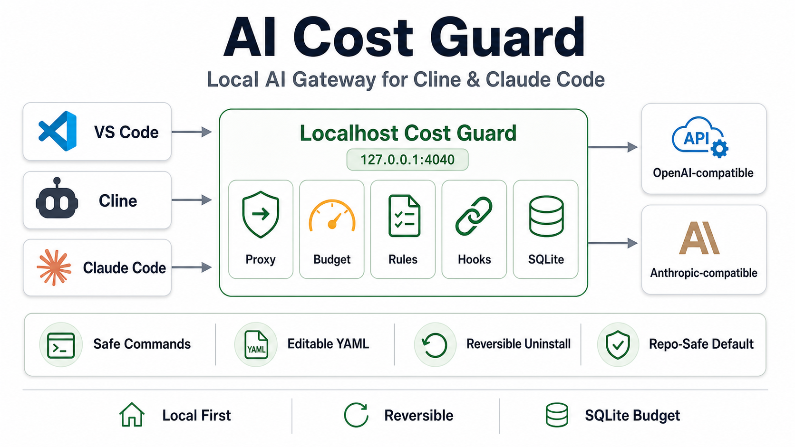

# AI Cost Guard

AI Cost Guard is a local-first AI gateway/middleware for developers using coding agents in VS Code, mainly Cline and Claude Code.

Technically, it is a local wrapper around model traffic and tool usage. It sits between the local coding agent and your configured upstream model provider, then applies budget checks, rule-based command guardrails, output limits, model aliases, and SQLite usage accounting before forwarding allowed requests.

In practical terms, it is a **local cost, safety, and usage-efficiency control layer for AI coding agents**. It gives teams a lightweight way to observe agent usage, estimate spend, prevent obvious secret leaks, reduce noisy tool output, and keep an easy rollback path for developer machines.

It is not a full agent, model provider, cloud service, Docker stack, Postgres service, VS Code extension, or magic optimizer. The package is intentionally small: a CLI, a localhost proxy, editable rules, optional Claude Code hooks, Cline configuration text, and local storage under `COSTGUARD_HOME`.



```text
VS Code
  Cline       -> http://127.0.0.1:4040/v1 -> Cost Guard -> OpenAI-compatible upstream
  Claude Code -> http://127.0.0.1:4040    -> Cost Guard -> Anthropic-compatible upstream
```

## At A Glance

- Local middleware: runs on the developer machine and forwards to the upstream provider you configure.
- Plug-and-play CLI: `setup`, `doctor`, `status`, `rules`, `budget`, `usage`, and `uninstall`.
- Reversible install: backs up Claude Code settings before adding Cost Guard and restores them on uninstall.
- Local budget store: uses SQLite in `COSTGUARD_HOME`, with optional model pricing from a configured catalog endpoint.
- Repo-safe by default: does not modify client repositories unless `costguard attach` is explicitly run.
- Editable rules: YAML rules can be reviewed and changed without changing Python code.
- Metadata-only logging: prompts and responses are not stored by default.

## What Problem It Solves

AI coding agents are powerful, but they can be hard to operate responsibly on a work laptop:

- Usage is often invisible until the provider bill or quota error appears.
- Long context, full diffs, recursive scans, and huge logs can waste tokens.
- Agents may accidentally request `.env`, keys, tokens, state files, or sensitive terminal output.
- Corporate AI gateways may enforce quotas or secret filters that are hard to distinguish from local budget issues.
- Setup and rollback should be safe for teammates who just want to try the tool.

Cost Guard addresses that narrow operational gap. It does not make the model smarter, but it makes agent usage more observable, more constrained, and easier to reason about.

## Monitoring And Usage Improvement

Cost Guard helps monitor and improve usage efficiency through local controls. This is about reducing avoidable token waste and operational surprises; it is not a promise of lower model latency or better model reasoning.

| Capability | What You Get |
| --- | --- |
| Usage visibility | `costguard usage today/month` shows requests, estimated tokens, estimated cost, top model, rule hits, budget blocks, and security blocks. |
| Budget control | Daily/monthly budget modes can warn, block premium models, or block all new calls. |
| Real pricing support | Optional `costguard pricing refresh` can cache model prices from a company/provider catalog instead of relying on fallback estimates. |
| Output reduction | Rules rewrite noisy commands such as full `git diff` or `find .`; output limits truncate oversized responses. |
| Secret guardrails | Default rules block `.env`, key-like files, Terraform state/vars, and secret-like payloads. |
| Debug clarity | Docs distinguish local Cost Guard budget decisions from upstream quota errors such as HTTP 429. |
| Local audit trail | SQLite stores metadata by default, not prompt/response content. |
| Optional Headroom compression | When a compatible Headroom adapter is installed and enabled, the proxy transforms request payloads before budget checks and upstream forwarding. |

The improvement loop is deliberately simple: inspect usage, identify noisy patterns, tune YAML rules/budgets/model aliases, refresh pricing when available, and rerun. It is an operating guardrail, not an autonomous optimization system.

## Core Components

These pieces are installed by `costguard setup` and are expected to work in the base solution:

| Component | Purpose |
| --- | --- |
| CLI | Runs setup, validation, status, budget, rules, usage, cache, Headroom status, and uninstall commands. |
| Local proxy | Provides `127.0.0.1:4040` for model traffic and forwards allowed requests to configured upstreams. |
| Config home | Stores all Cost Guard state under `COSTGUARD_HOME` or `~/.costguard` by default. |
| Claude home override | Uses `COSTGUARD_CLAUDE_HOME` instead of `~/.claude` when set, which is essential for safe smoke tests. |
| `.env` | Holds upstream base URLs, model names, local proxy key, and runtime flags. |
| `settings.yaml` | Holds tool selection, active model alias, budget mode, cache mode, and other local settings. |
| Rules | YAML files for blocked paths, blocked commands, command rewrites, log handling, and output limits. |
| Safe commands | Helper scripts such as `short-diff`, `safe-grep`, `summarize-log`, and `test-failures-only`. |
| SQLite store | Local `costguard.db` for usage metadata, budget checks, and audit events. |
| Pricing | Uses local fallback estimates by default; can refresh model pricing from a configured provider catalog. |
| Doctor checks | Validates required files, rules, hooks, safe commands, budgets, and proxy health. |
| Uninstall | Stops the proxy, restores Claude Code settings from a clean backup when available, and removes Cost Guard fragments otherwise. |

## Tool Integrations

These integrations are part of the base package, but they are only activated according to `--tool` and user configuration:

| Integration | How It Works |
| --- | --- |
| Cline | `costguard cline-config` prints OpenAI-compatible settings to paste into Cline. Cline is not edited automatically. |
| Claude Code | `setup --tool claude-code` or `setup --tool both` merges Cost Guard env vars and hooks into Claude Code `settings.json` after creating a backup. |
| Model aliases | `cg-cheap`, `cg-standard`, `cg-strong`, and `cg-sonnet` map to upstream model names configured in `.env`. |
| Hooks | Claude Code `PreToolUse` can block or rewrite risky/noisy tool calls; `PostToolUse` records local metadata. |

## Optional Components

These pieces are available but disabled or opt-in by default:

| Component | Default | Purpose |
| --- | --- | --- |
| Cache | Disabled | Local scaffold for basic or semantic cache modes. |
| Headroom | Disabled | Optional request compression adapter. Requires an importable `headroom` module exposing `compress_payload`, `compress_request`, `transform_payload`, or `apply`. |
| Pricing refresh | Not run | `costguard pricing refresh` reads `COSTGUARD_PRICING_URL` and caches provider model prices locally. |
| Project attach | Not run | `costguard attach` writes project-local Claude metadata only when explicitly requested. |
| Purge uninstall | Not run | `costguard uninstall --purge --yes` deletes `COSTGUARD_HOME`; plain uninstall keeps it. |
| Non-local bind host | Not used | The proxy defaults to `127.0.0.1` and warns if another host is selected. |
| Content logging | Disabled | Metadata is logged by default; prompt/response content is not stored unless explicitly enabled. |

## What It Does

- Runs a localhost proxy on `127.0.0.1:4040`.
- Supports Cline via OpenAI-compatible `/v1/chat/completions`.
- Supports Claude Code via Anthropic-compatible `/v1/messages`.
- Maps model aliases: `cg-cheap`, `cg-standard`, `cg-strong`, `cg-sonnet`.
- Enforces daily/monthly budgets with `warn`, `block-premium`, or `block-all`.
- Blocks secret-like paths and commands such as `cat .env`.
- Rewrites noisy commands such as full `git diff` and `find .`.
- Logs usage metadata to local SQLite without prompts or responses by default.
- Installs reversible Claude Code hooks and safe commands.
- Helps reduce avoidable token usage by rewriting noisy commands and limiting oversized outputs.
- Provides a simple feedback loop to tune usage patterns with `usage`, `budget`, `rules`, and optional `pricing` data.
- Separates local budget decisions from upstream provider quota/rate-limit errors.
- Applies optional Headroom request compression when a compatible adapter is installed and enabled.

## What It Does Not Do

- It does not replace Cline, Claude Code, or your corporate GenAI backends.
- It does not guarantee lower cost by itself; savings depend on rules, model choices, context hygiene, and team behavior.
- It does not make the upstream model faster or more accurate.
- It does not bypass corporate quotas, rate limits, or secret filters.
- It does not require Docker, Kubernetes, Postgres, or a cloud dashboard.
- It does not expose the proxy outside localhost unless you explicitly choose another host.
- It does not modify project repos unless you run `costguard attach`.
- It does not store real API keys in Git.
- It does not bundle Headroom or require it for the base product.
- It does not apply Headroom compression unless a compatible adapter is installed and explicitly enabled.

## Install

From a GitHub repo:

```bash
pipx install git+https://github.com/<user-or-org>/ai-costguard.git
```

For local development:

```bash
python -m venv .venv
.venv\Scripts\activate
pip install -e .[dev]
```

## Quickstart

```bash
costguard setup --tool both --daily-budget 5 --monthly-budget 100 --budget-mode warn --non-interactive
costguard doctor
costguard start
costguard cline-config
```

Then configure upstream endpoints and model names in:

```text
~/.costguard/.env
```

Set `COSTGUARD_HOME` and `COSTGUARD_CLAUDE_HOME` before setup if you want all files somewhere else. This is recommended for tests, demos, and shared internal validation.

## Cline Configuration

Run:

```bash
costguard cline-config
```

Paste the printed values into Cline:

```text
Provider: OpenAI Compatible
Base URL: http://127.0.0.1:4040/v1
API Key: sk-costguard-local
Model ID: cg-standard
```

## Useful Commands

```bash
costguard status
costguard doctor
costguard use cheap|standard|strong|sonnet
costguard budget status
costguard pricing status
costguard pricing refresh
costguard budget set --daily 5 --monthly 100
costguard budget mode warn|block-premium|block-all
costguard rules test "cat .env"
costguard rules test "git diff"
costguard usage today
costguard cache status
costguard headroom status
costguard uninstall
```

## Safe Local Development

Use isolated paths so setup and uninstall never touch your real home configuration:

```powershell
$env:COSTGUARD_HOME = "$(Get-Location)\.tmp\costguard"
$env:COSTGUARD_CLAUDE_HOME = "$(Get-Location)\.tmp\claude"
costguard setup --tool both --daily-budget 5 --monthly-budget 100 --budget-mode warn --non-interactive
costguard doctor
costguard rules test "cat .env"
costguard uninstall --yes
```

## Documentation

- `docs/RUNBOOK.md`: step-by-step operating guide.
- `docs/ARCHITECTURE.md`: local proxy architecture and data flow.
- `docs/SECURITY.md`: security model and local data handling.
- `docs/TROUBLESHOOTING.md`: common failures and fixes.
- `docs/prompts/work-pc-validation-prompt.es.md`: reusable Spanish prompt for controlled work-PC validation with Cline.

## License

MIT. See `LICENSE`.
